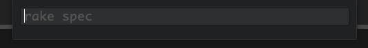

# "Run Command" for Atom

Execute any arbitrary command in [Atom](http://atom.io). Derived from Phil Nash's [Ruby Quick Test](https://github.com/philnash/ruby-quick-test).

# Usage
Smack `ctrl-r` to open up this:

Enter a command, and whack `enter` to run it:

Clack down `cmd-ctrl-r` to run it again:

Together, these let you do this:

(You can also toggle the command output with `cmd-ctrl-x`, or kill the last command with `cmd-ctrl-alt-x`)

# TODO
- ANSI color codes
- Setting the working directory
- Resizable output
- Editor variables (such as `$ATOM_PROJECT` for the current project directory)
